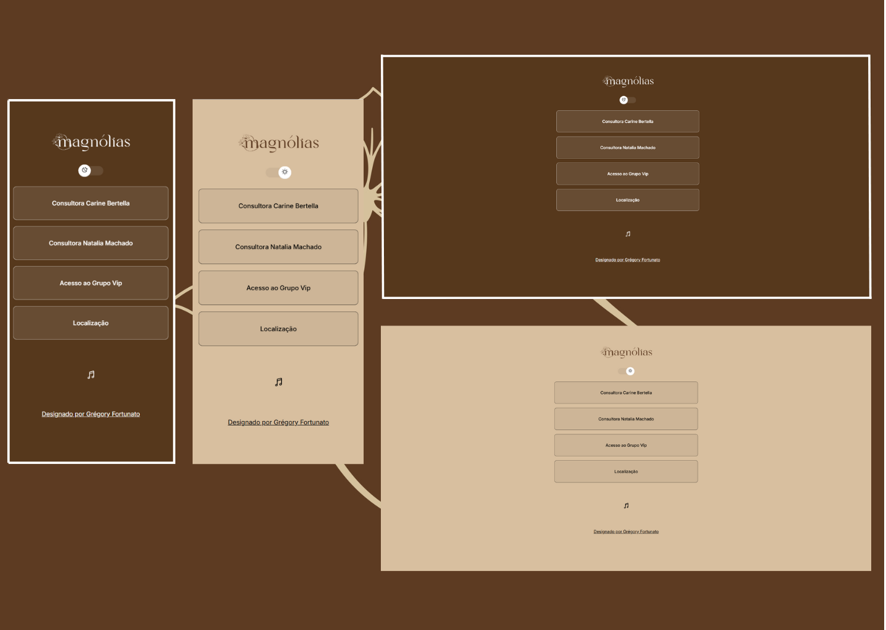

<h1 align="center"> AllMyLinks</h1>

Projeto desenvolvido por Grégory Fortunato através do curso promovido pela plataforma Rocketseat  

  <a href="#-tecnologias">Tecnologias</a>&nbsp;&nbsp;&nbsp;|&nbsp;&nbsp;&nbsp;
  <a href="#-projeto">Projeto</a>&nbsp;&nbsp;&nbsp;|&nbsp;&nbsp;&nbsp;
  <a href="#-layout">Layout</a>&nbsp;&nbsp;&nbsp;|&nbsp;&nbsp;&nbsp;
  <a href="#memo-licença">Licença</a>

  

 

  

 

## 💼 Cartão de Visitas Online

Um cartão de visitas digital moderno, onde você pode adicionar e organizar links que levam a diferentes plataformas, sites e redes sociais para que outras pessoas conheçam mais sobre o seu trabalho.

 

## ✨ Sobre o projeto

Este projeto foi criado para profissionais, freelancers, criadores de conteúdo e empreendedores que desejam compartilhar seus principais canais de contato e portfólio em um único lugar. O objetivo é oferecer uma alternativa elegante, simples e personalizada para centralizar sua presença online.

 

## 🔗 Funcionalidades

- Interface responsiva (funciona bem em dispositivos móveis)
- Links personalizados com nome e ícone
- Visual leve, limpo e fácil de navegar
- Ideal para usar como “link na bio” em redes sociais

 

## 🛠️ Tecnologias utilizadas

- HTML5
- CSS
- JavaScript

 
